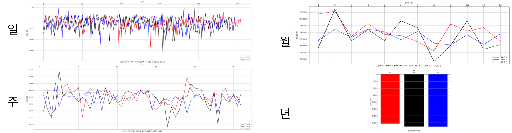
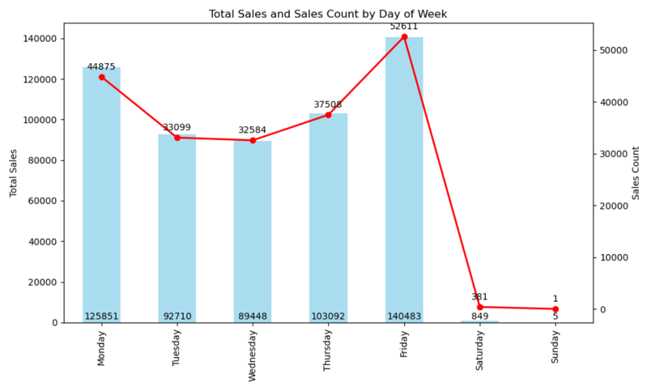
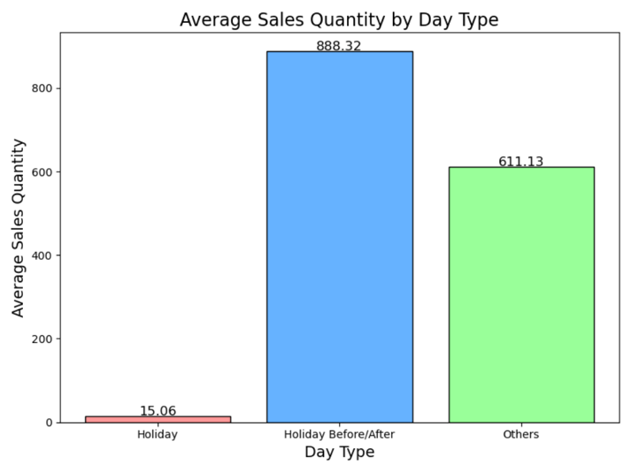
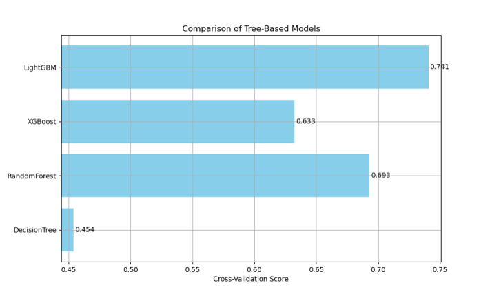
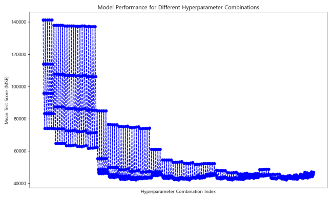

# 유통 데이터 기반 라면 및 면류 수요 예측

## 1. 프로젝트 개요  
본 프로젝트는 **유통 데이터를 활용하여 라면 및 면류 상품의 미래 수요를 예측**하는 것을 목표로 한다.  

### 주요 목표  
- **가공식품(라면 및 면류) 수요 예측 모델 구축**  
- **유통 및 재고 관리 최적화를 위한 데이터 분석 및 시계열 모델 적용**  

## 2. 제공받은 데이터 구조  
- **데이터 크기:** 1095 rows × 5 columns  
- **데이터 유형:** 판매 및 반품 기록  
- **주요 컬럼 설명:**
  - **판매일:** 판매 또는 반품이 발생한 날짜 (YYYY-MM-DD 형식)
  - **구분:** `매출`(판매) 또는 `반품` 여부
  - **우편번호:** 거래가 발생한 지역의 우편번호
  - **매출처코드:** 특정 매출처(고객/업체)의 코드
  - **판매수량:** 해당 품목의 판매 또는 반품된 수량
  - **옵션코드:** 상품의 옵션 구분 (예: `BX`, `EA`)
  - **규격:** 상품의 포장 단위 (예: `3입`, `12입`, `3팩*8` 등)
  - **입수:** 한 묶음에 포함된 상품 개수
  - **상품 바코드(대한상의):** 해당 상품의 표준 바코드 번호
  - **상품명:** 해당 상품의 상세 명칭
  - **대분류:** 상품의 대분류 (예: `식품`, `비식품`)
  - **중분류:** 상품의 중분류 (예: `가공식품류`, `화장지류`)
  - **소분류:** 상품의 세부 분류 (예: `식용유`, `설탕,소금,조리료류`, `업소(잡화)`, 일부 값 `NaN`)


## 3. 중분류(라면, 통조림, 상온즉석) 수요 예측  

### 3.1 데이터 시각화 및 분석  

#### 3.1.1 일/주/월/년 별 총 판매 수량 시각화  
  
➡ **데이터의 복잡성으로 인해 명확한 시계열 패턴을 도출하기 어려움**  

#### 3.1.2 요일별 총 판매 수량 & 판매 건수 시각화  
  
➡ **주말에는 판매량이 거의 없으며, 주말 전/후로 판매량 증가**  

✅ **가설 1:** 휴일(주말 및 공휴일 포함)에는 판매량이 거의 없고, 전/후일에는 판매량 증가  

#### 3.1.3 지역(우편번호)별 총 판매 수량 & 판매 건수 시각화  
별_총_판매수량&판매_건수_시각화.png)  
- **포항시 남구, 포항시 북구, 경주시**에서 판매량이 가장 높음  
- 기타 지역에서는 판매 건수 대비 판매 수량이 낮음  

➡ **예측에 불필요한 데이터로 판단하여 일부 지역 데이터 제거**  


### 3.2 가설 검증  

#### ✅ 가설 1: 휴일 전/후 판매량 증가  
  
- **휴일에는 판매량이 거의 없고, 휴일 전/후 판매량이 일반 일보다 높음**  
➡ **`휴일 여부`, `휴일 전/후 여부` 파생 변수 추가**  

### 3.3 데이터 전처리  

- **중분류(라면, 통조림, 상온즉석)만 선택**  
- **반품 데이터 제외 (구분 불가능한 경우 분석에서 제외)**  
- **날짜 관련 파생 변수 생성 (요일, 주차, 일자, 월 변수 추가)**  
- **휴일 관련 파생 변수 생성 (휴일 여부, 휴일 전/후 여부 변수 추가)**  
- **누락 날짜 보완 (누락된 날짜를 0으로 설정하여 추가)**  

**전처리 완료 데이터 구조:**  
  

### 3.4 예측 모델 설계 
#### 3.4.1 모델 선택
-  주어진 데이터는 규모가 작은 정형 데이터이기에 **트리 기반 모델**들이 적합하다고 판단
- **K-교차 검증**을 통한 모델 선택(`DecisionTree`, `RandomForest`, `XGBoost`, `LightGBM`)

  
➡ **LightGBM을 최적 모델로 선정**  


**GridSearchCV 하이퍼파라미터 탐색 범위:**
```python
param_grid = {
    'n_estimators': [10,20,30,40,50,60,70,80,90,100],
    'max_depth': [1,2,3,4,5],
    'min_child_samples': [16,18,20,22,24],
    'num_leaves': [20,25,31,35,40],
    'learning_rate': [0.01, 0.05, 0.1, 0.15, 0.2],
    'random_state': [42]
}
```

#### 3.4.3 **학습 결과(Scoring: `neg_mean_squared_error`)**


#### 3.4.4 **최종 모델 평가 **  
- **최종 모델 성능 점수:** `42121.80`
- 선정된 파라미터 

| Parameter | Value | 
|-----------|------| 
|n_estimators| 60 | 
|max_depth| 3 | 
|min_child_samples|	20 | 
|num_leaves| 20 | 
|learning_rate| 	0.1 | 
|random_state| 	42| 


### 3.5 최종 예측 결과 (2024년도)  
  

**결론:**  
- **2024년도 예측값이 정상 범위 내에 존재**  
- **목적에 적합한 예측 모델 구축 완료**  


## 4. 대분류(면류, 라면류) 수요 예측  

### 4.1 데이터 분석 및 시각화  

#### 4.1.1 연도별 판매량 변화  
  
- **2021년~2022년:** 월별 데이터  
- **2023년:** 일별 데이터  
➡ **1Data와 다른 구조로 인해 동일한 분석 기법 적용 불가능**  
➡ **월별 집계 후 예측 수행**  

#### 4.1.2 피어슨 상관 계수 분석  
  
- **생활잡화 및 가공식품류와 면류·라면류는 양의 상관관계를 보임**  

#### 4.1.3 휴일 유무 분석
- 1data 분석 결과에 의거하여, 휴일 개수는 판매량에 영향력이 있다고 가정
➡ 생활잡화/가공식품류/면류.라면류 월별 집계 후 **각 월의 휴일의 개수**를 파생 변수로 추가


### 4.2 데이터 전처리  

- **대분류(`면류, 라면류`)만 선택**  
- **판매 확정 데이터만 사용 (반품 데이터 제외)**  
- **월별 판매수량 합산하여 데이터프레임 생성**  
- **각 달의 휴일 개수 변수 추가**  

**전처리 완료 데이터 구조:**  
  


### 4.3 수요 예측 모델 구축  
- 1Data의 경우, 데이터가 충분하여 시계열 분석까지 필요 없다고 판단
- 그러나 2Data의 경우, 매우 규모가 작기 때문에 시계열 정보를 추가로 포함시켜 예측 성능을 향상시키고자 함.
- **Prophet을 모델 활용 (시계열 분석 모델)**  
> 다른 시계열 머신러닝(ARIMA, SARIMA 등)과 달리 비교적 편리한 모델 구축 <br>
> 모델의 구성 요소가 명확하게 분리되어 있어 결과 해석에 용이


#### 4.3.1 최종 예측 결과 (2024년도)  
  

- **예측값이 정상 범위 내에 존재함을 확인**  
- **목적에 적합한 예측 모델 구축 완료**  

### 4.4 Prophet 모델 구성 요소 분석  
  

- **Trend:** 지속적으로 감소  
- **Yearly Seasonality:** 판매량에 가장 큰 영향을 미침  
- **Extra_Regressor(휴일 개수):** 미약하지만 판매량에 영향  

## 5. 결론  
- **"LightGBM(머신러닝)**과 **Prophet(시계열 모델)**을 활용하여 수요 예측 모델을 성공적으로 구축함.
- 실제 유통 데이터에 적용하면 **운영 효율성**이 향상될 가능성이 높음.